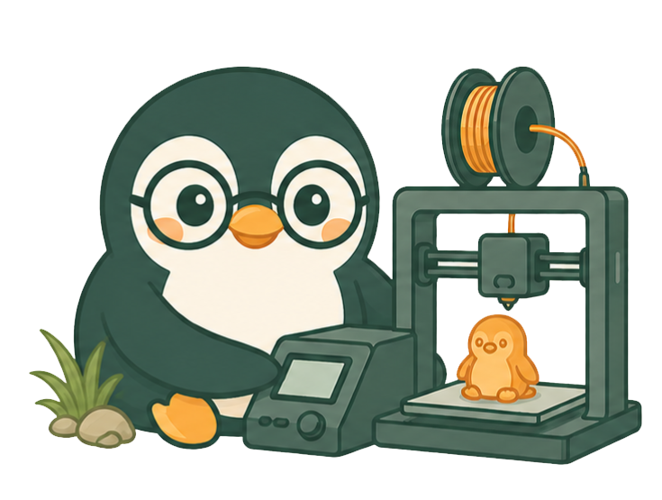

<div align="center">
  <!-- ESPACIO PARA EL ISOLOGO DEL PROYECTO -->
  
  
  <h1>Le Pingouin Studio Print - Admin Panel</h1>
  
  <p>
    Este repositorio contiene el código fuente del panel de administración (frontend) para <b>Le Pingouin Studio Print</b>. Está diseñado para ofrecer una interfaz moderna, rápida y segura para la gestión de productos, pedidos, cotizaciones, y usuarios del sistema.
  </p>

  <!-- TAGS DE TECNOLOGÍAS UTILIZADAS -->
  <div style="display: flex; justify-content: center; gap: 10px; flex-wrap: wrap; margin-top: 15px;">
    
    
    
    
    
    
  </div>
</div>

<br />

## 🚀 Tecnologías Principales

El panel de administración está construido con el siguiente stack de tecnologías para asegurar alto rendimiento y una excelente experiencia de usuario (UX):

- **Framework:** Next.js (App Router)
- **Librería UI:** React 19
- **Lenguaje:** TypeScript
- **Estilos:** Tailwind CSS (v4)
- **Componentes UI:** Shadcn UI y Base UI
- **Manejo de Estado / Fetching:** TanStack React Query
- **Manejo de Formularios:** React Hook Form
- **Iconos:** Lucide React
- **Gráficos:** Recharts

## 📁 Estructura del Proyecto

```text
lpsp-admin/
├── app/            # Next.js App Router (Páginas, Layouts, API Routes).
├── components/     # Componentes de UI reutilizables (Shadcn, personalizados).
├── lib/            # Utilidades, configuración y helpers (ej. tailwind-merge, clsx).
├── public/         # Recursos estáticos (imágenes, isologo, fuentes).
├── hooks/          # Custom hooks de React.
├── types/          # Definiciones de tipos e interfaces globales de TypeScript.
├── package.json    # Dependencias y scripts del proyecto.
└── tailwind.css    # Configuración principal de estilos.
```

## 🛠️ Instalación y Configuración

Sigue estos pasos para ejecutar el panel de administración en tu entorno local:

1. **Clonar el repositorio:**
   ```bash
   git clone <url-del-repositorio>
   cd lpsp-admin
   ```

2. **Instalar dependencias:**
   ```bash
   npm install
   ```

3. **Configurar variables de entorno:**
   Crea un archivo `.env.local` en la raíz del proyecto. Deberás incluir las URLs necesarias para conectarse al backend y otros servicios:
   ```env
   NEXT_PUBLIC_API_URL=http://localhost:3000/api  # URL del backend (lpsp-backend)
   ```

## 🚦 Scripts Disponibles

- `npm run dev` - 🚀 Inicia el servidor de desarrollo.
- `npm run build` - 📦 Compila la aplicación para producción.
- `npm run start` - ⚙️ Inicia la aplicación en modo producción (requiere compilar primero).
- `npm run lint` - 🧹 Ejecuta el linter (ESLint) para buscar errores en el código.

## 🎨 Diseño y UI

El proyecto hace un uso intensivo de **Shadcn UI** y **Tailwind CSS v4** para ofrecer componentes accesibles y con un diseño premium y responsivo. Se integran animaciones fluidas para una interfaz dinámica.

---
*Desarrollado para **Le Pingouin Studio Print*** 🐧
